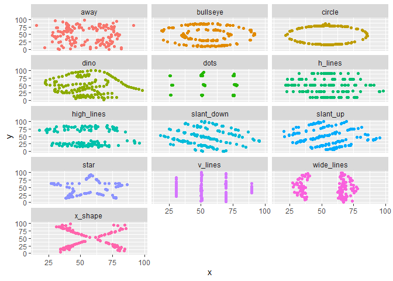

Lab 01 - Hello R
================
Ryan W
2/6/2022

## Load packages and data

``` r
library(tidyverse)
library(datasauRus)
```

## Exercises

### Exercise 1

datasaurus_dozen has: 1846 rows, 3 variables, but I don’t see anywhere
in the help where it says the number of columns or what the variables
are.

### Exercise 2 – completed

The answers for this exercise are given for you below. But you should
clean up some of the narrative so that it only includes what you want to
turn in.

First let’s plot the data in the dino dataset:

``` r
dino_data <- datasaurus_dozen %>%
  filter(dataset == "dino")

ggplot(data = dino_data, mapping = aes(x = x, y = y)) +
  geom_point()
```

<!-- -->

And next calculate the correlation between `x` and `y` in this dataset:

``` r
dino_data %>%
  summarize(r = cor(x, y))
```

    ## # A tibble: 1 x 1
    ##         r
    ##     <dbl>
    ## 1 -0.0645

### Exercise 3

``` r
star_data <- datasaurus_dozen %>%
  filter(dataset == "star")

ggplot(data = star_data, mapping = aes(x = x, y = y)) +
  geom_point()
```

<!-- -->

``` r
star_data %>%
  summarize(r = cor(x, y))
```

    ## # A tibble: 1 x 1
    ##         r
    ##     <dbl>
    ## 1 -0.0630

This is almost the same correlation as the dinosaur data.

### Exercise 4

Add code and narrative as needed. Note that two R chunks are given but
they are not labeled. Use the convention from above to name them
appropriately.

``` r
circle_data <- datasaurus_dozen %>%
  filter(dataset == "circle")

ggplot(data = circle_data, mapping = aes(x = x, y = y)) +
  geom_point()
```

<!-- -->

``` r
circle_data %>%
  summarize(r = cor(x, y))
```

    ## # A tibble: 1 x 1
    ##         r
    ##     <dbl>
    ## 1 -0.0683

Again, this very close to the linear association for the dino dataset.
Also, I feel like I was sold a false bag of goods because this plot sure
looks like an oval – not a circle.

### Exercise 5

Add code and narrative as needed.

To add R chunks either type out the backticks, curly braces, and the
letter `r` or use the Insert chunk button above, green C+.

``` r
ggplot(datasaurus_dozen, aes(x = x, y = y, color = dataset))+
  geom_point()+
  facet_wrap(~ dataset, ncol = 3) +
  theme(legend.position = "none")
```

<!-- -->

``` r
datasaurus_dozen %>%
  group_by(dataset) %>%
  summarize(r = cor(x, y)) %>%
  print(13)
```

    ## # A tibble:
    ## #   13 x 2
    ##    dataset   
    ##    <chr>     
    ##  1 away      
    ##  2 bullseye  
    ##  3 circle    
    ##  4 dino      
    ##  5 dots      
    ##  6 h_lines   
    ##  7 high_lines
    ##  8 slant_down
    ##  9 slant_up  
    ## 10 star      
    ## 11 v_lines   
    ## 12 wide_lines
    ## 13 x_shape   
    ## # ... with 1
    ## #   more
    ## #   variable:
    ## #   r <dbl>

Note: I wasn’t able to resize my figures or change the look of my report
because there was no place that said “Output options…” or anything
similar when I clicked on the gear at the top of my markdown document.

## Bonus Tips by Yoo Ri

Here are some helpful tips :)

-   filter() is for extracting rows

-   group_by() is for grouping datasets by assigned column

-   ungroup() cancels the grouping

-   summarize() is often used with group_by(). This function can print
    the output according to the group_by().

-   facet_grid(y\~x,…) creates a grid with variable y as a row, variable
    x as a column  

-   facet_wrap(x,… ) is useful when there is only one variable
